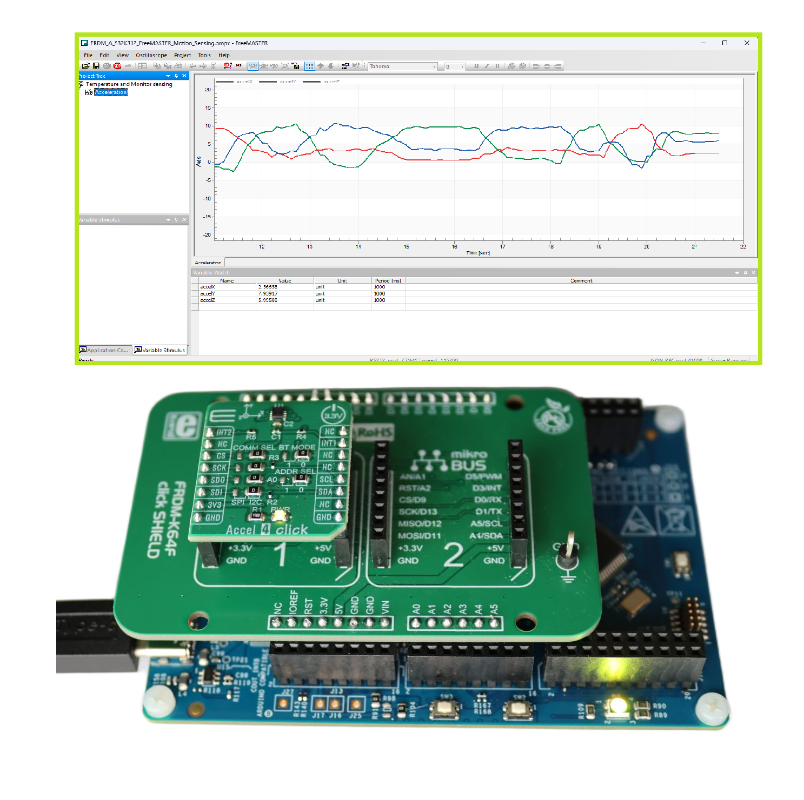
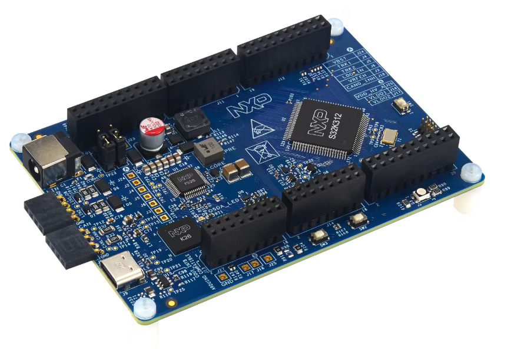
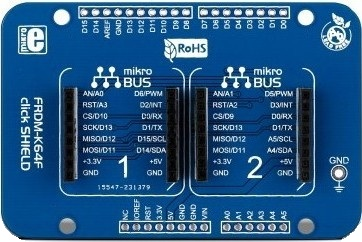
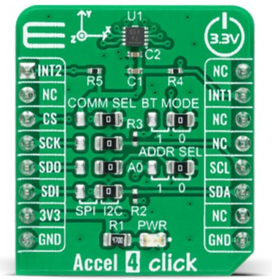
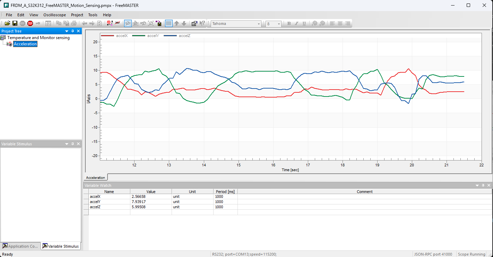

# NXP Application Code Hub

## Motion Sensing using FreeMASTER
This application demonstrates real-time motion sensing and visualization on the FRDM-A-S32K312 evaluation board. It reads 3-axis acceleration data from an FXLS8964AF accelerometer over LPI2C and uses GPIO-driven RGB LED feedback to indicate board orientation and shake events. Tilt orientation is represented through six distinct LED colors mapped to each axis direction, while shake detection triggers a triple-flash animation with a built-in cooldown. All accelerometer variable are exposed in real time via FreeMASTER, enabling live plotting and debugging from a PC.
[

](./images/demo.png)

#### Boards: FRDM-A-S32K312
#### Categories: Graphics, Tools
#### Peripherals: SIUL2, I2C
#### Toolchains: S32 Design Studio IDE

## Table of Contents
1. [Software and Tools](#step1)
2. [Hardware](#step2)
3. [Setup](#step3)
4. [Results](#step4)
5. [Support](#step5)
6. [Release Notes](#step6)

## 1. Software and Tools
This example was developed using the FRDM Automotive Bundle for S32K3. To download and install the complete software and tools ecosystem, use the following link:
- [S32K3 FRDM Automotive Board Installation Package](https://www.nxp.com/app-autopackagemgr/automotive-software-package-manager:AUTO-SW-PACKAGE-MANAGER?currentTab=0&selectedDevices=S32K3&applicationVersionID=156)
- [FreeMASTER Run-Time Debugging Tool](https://www.nxp.com/design/design-center/software/development-software/freemaster-run-time-debugging-tool:FREEMASTER)

## 2. Hardware
### 2.1 Required Hardware
- Personal Computer
- Type-C USB cable

| Boards | Images |
| ------ | ------ |
| - [FRDM-A-S32K312](https://www.nxp.com/design/design-center/development-boards-and-designs/FRDM-A-S32K312) |  |
| - [FRDM K64 click shield](https://www.mikroe.com/frdm-k64-click-shield) | 
 |
| - [Accel 4 Click](https://www.mikroe.com/accel-4-click) | 
 |

### 2.2 Hardware Connections
| FRDM-A-S32K312   | Header Pin |I/O| FRDM Shield  | Click Board   | Click Pin | Description  |
|------------------|------------|---|--------------|---------------|-----------|--------------|
| PTC6 LPI2C1_SDA  | J2 pin 17  | → | SDA          | Accel 4 Click | SDA       | I2C SDA Pin  |
| PTC7 LPI2C1_SCL  | J2 pin 19  | → | SCL          | Accel 4 Click | SCL       | I2C SCL Pin  |
| GND              | JA3 pin 11 | → | GND          | Accel 4 Click | GND       | Ground       |
| VDD_PERH         | JA3 pin 7  | → | 3.3V         | Accel 4 Click | 3V3       | Power Supply |

### 2.3 Debugger Connection
Connect the Type-C USB cable to PC and FRDM-A-S32K312 board for power supply and debugging.

## 3. Setup

### 3.1 Import the Project into S32 Design Studio IDE
1. Open S32 Design Studio IDE, in the Dashboard Panel, choose **Import project from Application Code Hub**.
   [

](./images/import_project_1.png)

2. Find the demo by searching: [dm-motion-sensing-frdm-a-s32k312-freemaster](https://mcuxpresso.nxp.com/appcodehub?search=dm-motion-sensing-frdm-a-s32k312-freemaster)
3. Open the project, click the **GitHub link** from this window, S32 Design Studio IDE will automatically retrieve project attributes, then click **Next>**.
    [

](./images/import_project_3.png)

4. Select **main** branch and then click **Next>**.

5. Select your local path for the repo in **Destination->Directory:** window. The S32 Design Studio IDE will clone the repo into this path, click **Next>**.

6. Select **Import existing Eclipse projects** then click **Next>**.

7. Select the project in this repo (only one project in this repo) then click **Finish**.

### 3.2 Generating, Building and Running the Example
1. In Project Explorer, right-click the project and select **Update Code and Build Project**. This will generate the configuration (Pins, Clocks, Peripherals), update the source code and build the project using the active configuration (e.g. Debug_FLASH).
Make sure the build completes successfully and the *.elf file is generated without errors.
[

](./images/update_and_build.png)
Press **Yes** in the **SDK Component Management** pop-up window to continue.

2. Go to **Debug** and select **Debug Configurations**. There will be a debug configuration for this project:
[

](./images/Debug_config.png)

        Configuration Name                  Description
        -------------------------------     -----------------------
        $(example)_debug_flash_pemicro      Debug the FLASH configuration using PEmicro probe

    Select the desired debug configuration and click on **Debug**. Now the perspective will change to the **Debug Perspective**.
    Use the toolbar controls to manage program flow.

### 3.3 How It Works
After initializing MCU clocks, GPIO pin mux, and LPI2C1, FreeMASTER is configured to use **LPUART6** as its serial transport via `FMSTR_SerialSetBaseAddress((FMSTR_ADDR)IP_LPUART_6_BASE)`, then initialized with `FMSTR_Init()`. The FXLS8964AF accelerometer is initialized over I2C before the main loop starts.

In the main loop, sensors are sampled every 50 ms using a non-blocking timer. On each tick, the FXLS8964AF accelerometer is read and the raw 6-byte data is converted to X/Y/Z acceleration values (stored in `volatile float accelX`, `accelY`, `accelZ`). If a shake event is detected, the firmware enters a **shake animation state** that performs three white LED flashes (1 s period each) with a cooldown to prevent repeated triggering. Otherwise, `UpdateTiltIndicator()` maps the dominant axis to an RGB LED color (Green/Cyan/Red/Yellow/Blue/Magenta). `FMSTR_Poll()` is serviced inside the ISR via `FMSTR_LPUART6_Isr`, keeping all three global variables continuously visible and watchable from the FreeMASTER PC application.

## 4. Results
After flashing and running the application on the FRDM-A-S32K312:
- The system continuously monitors acceleration data over LPI2C.
- If a shake event is detected:
    - The RGB LED performs a triple-flash animation.
    - A cooldown period prevents repeated triggering.
- Board orientation is displayed using LED color coding:
    - Positive X axis -> Green
    - Negative X axis -> Cyan
    - Positive Y axis -> Red
    - Negative Y axis -> Yellow
    - Positive Z axis -> Blue
    - Negative Z axis -> Magenta

Results can also be visualized using the [FreeMASTER Run-Time Debugging Tool](https://www.nxp.com/design/design-center/software/development-software/freemaster-run-time-debugging-tool:FREEMASTER) PC application.

1. After generating the .elf file, run the application on the FRDM-A-S32K312 board.
2. Open **FreeMASTER** on your PC and load the `FRDM_A_S32K312_FreeMASTER_Motion_Sensing.pmpx` project file.
3. In FreeMASTER, click the **GO!** green button (**Start Communication**) to connect; it will search the COM port of the board at baud rate **115200**.
4. The accelerometer variables all update in real time to reflect any changes to the board's motion.
5. See the plots on the FreeMASTER application below:
   - Acceleration plot:
   [

](./images/demo_2.png)

## 5. Support
For general technical questions related to NXP microcontrollers, please use the [NXP Community Forum](https://community.nxp.com/).
#### Project Metadata

<!----- Boards ----->

<!----- Categories ----->

<!----- Peripherals ----->

<!----- Toolchains ----->

Questions regarding the content/correctness of this example can be entered as Issues within this GitHub repository.

>**Note**: For more general technical questions regarding NXP Microcontrollers and the difference in expected functionality, enter your questions on the [NXP Community Forum](https://community.nxp.com/)

## 6. Release Notes
| Version | Description / Update                           | Date                        |
|:-------:|------------------------------------------------|----------------------------:|
| 1.0     | Initial release on Application Code Hub        | July 3rd 2026    |
